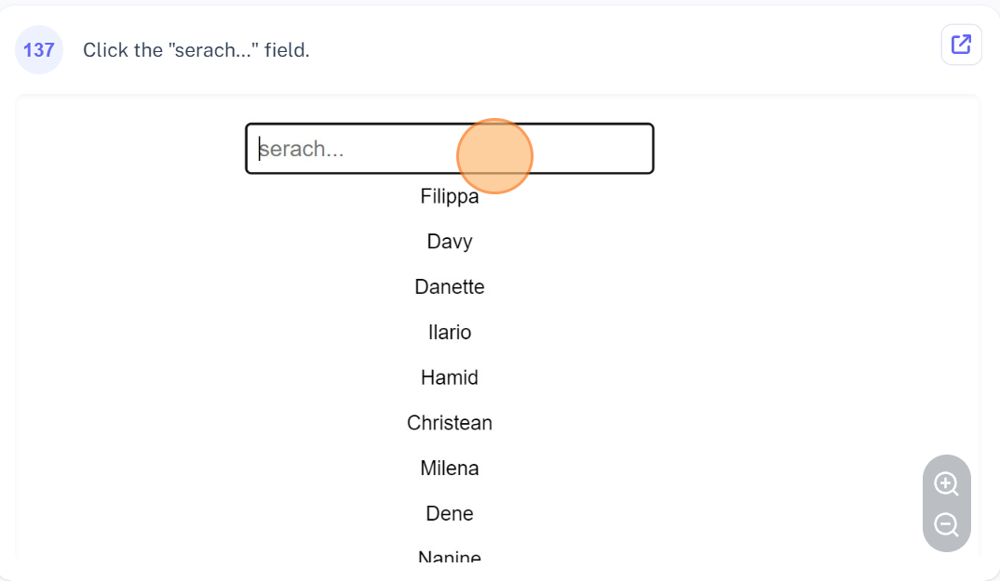
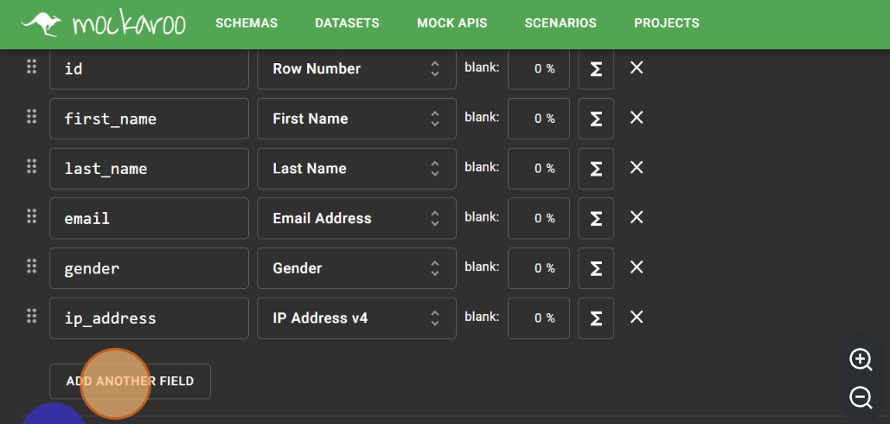

# React-search-filter

React-search-filter is a simple and customizable search filter component for React. It allows users to easily search and filter through data sets with a user-friendly interface. This component is easy to use and can be easily integrated into any React project. Try it out and let us know what you think!
## Screenshots

## Resources

Mockaroo is a tool that I used to generate fake data for my search application. It is a useful resource for creating test data and allows for easy customization of data sets. This made it perfect for my needs in building my search app.

## 🛠 Skills
Javascript, HTML, CSS...

## Tech Stack

**Client:** HTML, React, CSS

## Authors

- [@fazzy12](https://www.github.com/fazz12)

